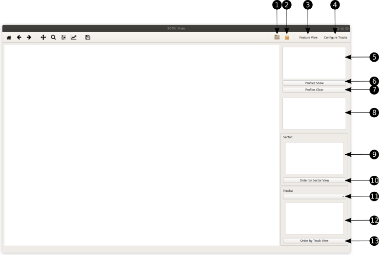
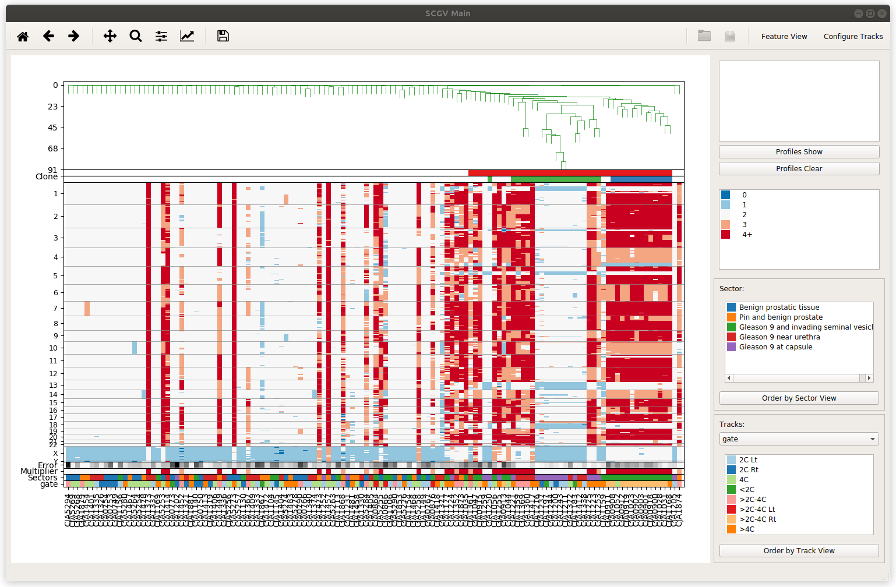
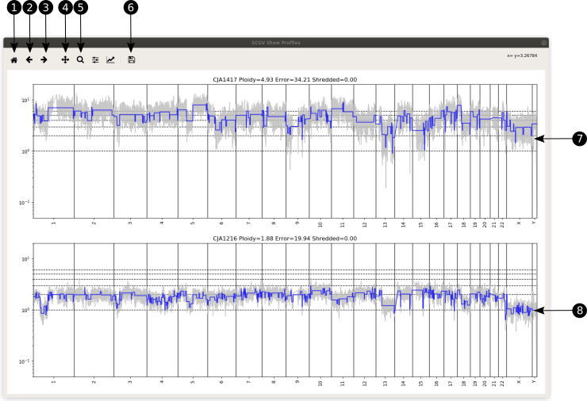
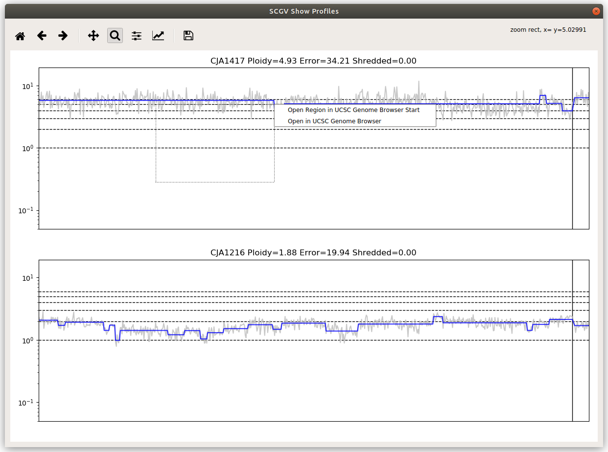
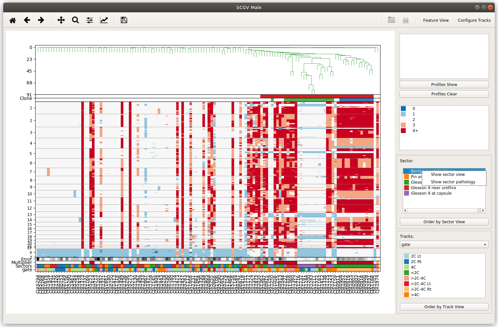
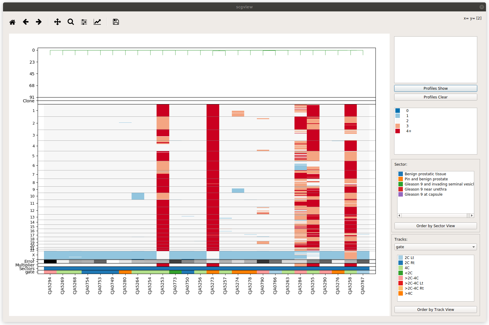
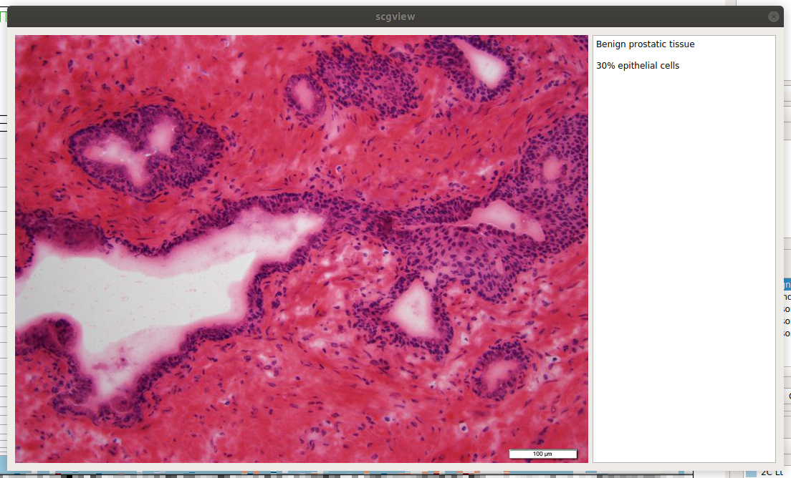
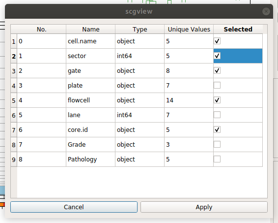
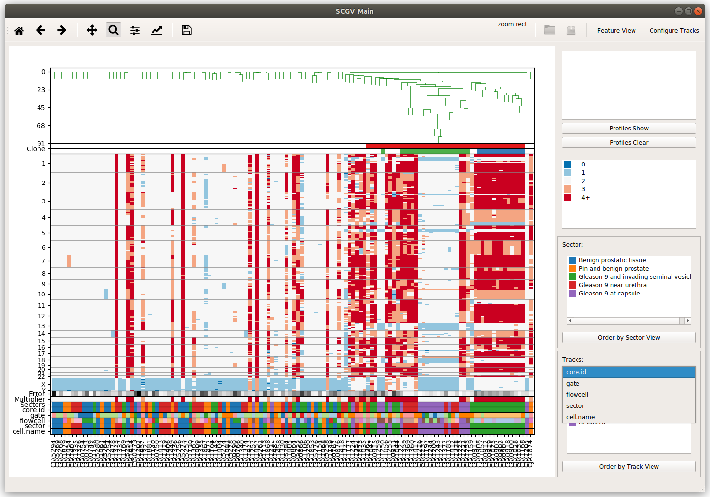
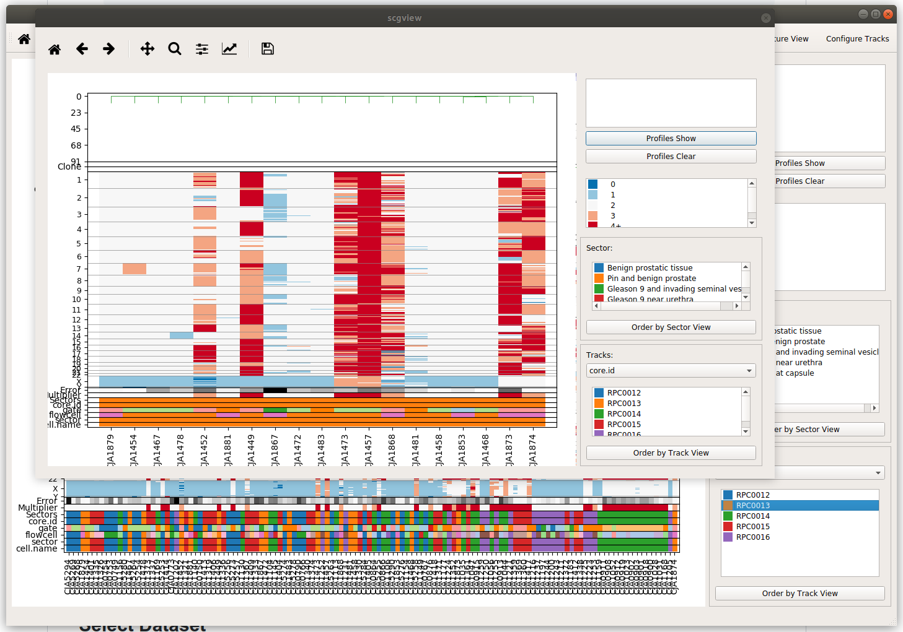

# Single Cell Genome Viewer (SCGV)

[](https://zenodo.org/badge/latestdoi/76399432)

SCGV is an interactive graphical tool for single-cell genomics data, with
emphasis on single-cell genomics of cancer. It facilitates examination, jointly
or individually, of DNA copy number profiles of cells harvested from
multiple anatomic locations (sectors). In the opening view the copy-number
data matrix, with columns corresponding to cells and rows to genomic locations,
is represented as a heat map with color-encoded integer DNA copy number. If a
phylogenetic tree is available for the cells comprising the dataset, it can be
used to order the columns of the data matrix, and clones formed by closely
related cells may be identified. Alternatively, the columns
can be ordered by the sector of origin of the cells. Cyto-pathological
information may be displayed in a separate view, including sector-specific
slide images and pathology reports. Genomic sub-regions and
random subsets of cells can be selected and zoomed into. Individual or multiple
copy-number profiles may be plotted as copy number against the genomic
coordinate, and these plots may again be zoomed into. Chromosomal regions
selected within the profiles may be followed to UCSC genome browser to
examine the genomic context.

Short video introduction to SCGV can be found here:

[](https://www.youtube.com/watch?v=blvXRedv9xc)

## Anaconda Environment Setup

### Install Anaconda

* Go to anaconda web site 
[https://www.continuum.io/downloads](https://www.continuum.io/downloads)
and download the latest anaconda installer for your operating system. SCGV uses
*Python 3.6* or later so you need to choose the appropriate Anaconda installer.

* Install anaconda into suitable place on your local machine following
instructions from
[https://docs.continuum.io/anaconda/install](https://docs.continuum.io/anaconda/install)

### Create Anaconda `scgv` environment

* To create `scgv` environment use:

    ```bash
    conda create -n scgv
    ```

* Activate the newly created environment with:

    ```bash
    conda activate scgv
    ```

### Conda installer for SCGV

* To install SCGV you can use KrasnitzLab Anaconda channel:

    ```bash
    conda install -c krasnitzlab scgv
    ```

* To run the SCGV viewer run following command:

    ```bash
    scgview
    ```

## Dataset Directory Structure

* Files in the dataset should conform to the following naming convention. Each filename
should end with two dot-separated words. The last word is the usual file extension
and second to last is the file type. For example:

    ```bash
    example.featuremat.txt
    ```

    is a `txt` file, that contains `featuremat` used by the viewer.

* Example dataset directory is located in subdirectory
`exampledata/example.directory` of the project main directory. The content of the
example dataset directory is as follows:

    ```bash
    .
    ├── example.cells.csv
    ├── example.clone.txt
    ├── example.genome.txt
    ├── example.guide.txt
    ├── example.featuremat.txt
    ├── example.features.txt
    ├── example.ratio.txt
    ├── example.seg.txt
    ├── example.tree.txt
    └── pathology
        ├── 9727420.color.map.060414.png
        ├── Area1.Benign.jpg
        ├── Area1.Benign.txt
        ├── Area2.PIN.with.Benign.jpg
        ├── Area2.PIN.with.Benign.txt
        ├── Area3.GS9.invading.SV.jpg
        ├── Area3.GS9.invading.SV.txt
        ├── Area4.GS9.near.Urethra.jpg
        ├── Area4.GS9.near.Urethra.txt
        ├── Area5.GS9.at.Capsule.jpg
        ├── Area5.GS9.at.Capsule.txt
        └── description.csv
    ```

* Optionally the dataset directory may contain a `pathology` subdirectory that
contains pathology images and notes. This subdirectory should contain a file called
`description.csv` with the following structure:

    ```csv
    sector,pathology,image,notes
    1,Benign prostatic tissue,Area1.Benign.jpg,Area1.Benign.txt
    2,Pin and benign prostate,Area2.PIN.with.Benign.jpg,Area2.PIN.with.Benign.txt
    3,Gleason 9 and invading seminal vesicle,Area3.GS9.invading.SV.jpg,Area3.GS9.invading.SV.txt
    4,Gleason 9 near urethra,Area4.GS9.near.Urethra.jpg,Area4.GS9.near.Urethra.txt
    5,Gleason 9 at capsule,Area5.GS9.at.Capsule.jpg,Area5.GS9.at.Capsule.txt
    ```

First column in `description.csv` contains the name/id of the sector as
specified in the `guide` file,
the second column is a description of the sector and the last two columns
contain file names of pathology image and notes.

## Dataset Archive Structure

* Viewer supports datasets stored as a `ZIP` archives. Files from the
archive dataset should follow the same naming convention as for dataset
directories.

* Example dataset ZIP archive is found in `exampledata/example.archive.zip`
into project main directory. The structure of the example dataset is as follows:

    ```bash
    unzip -t example.archive.zip 
    Archive:  example.archive.zip
        testing: pathology/               OK
        testing: pathology/Area5.GS9.at.Capsule.jpg   OK
        testing: pathology/Area4.GS9.near.Urethra.jpg   OK
        testing: pathology/Area3.GS9.invading.SV.jpg   OK
        testing: pathology/Area2.PIN.with.Benign.jpg   OK
        testing: pathology/Area1.Benign.jpg   OK
        testing: pathology/Area5.GS9.at.Capsule.txt   OK
        testing: pathology/Area4.GS9.near.Urethra.txt   OK
        testing: pathology/Area1.Benign.txt   OK
        testing: pathology/description.csv   OK
        testing: pathology/Area2.PIN.with.Benign.txt   OK
        testing: pathology/Area3.GS9.invading.SV.txt   OK
        testing: example.cells.csv        OK
        testing: example.clone.txt        OK
        testing: example.featuremat.txt   OK
        testing: example.features.txt     OK
        testing: example.genome.txt       OK
        testing: example.guide.txt        OK
        testing: example.ratio.txt        OK
        testing: example.seg.txt          OK
        testing: example.tree.txt         OK
    No errors detected in compressed data of example.archive.zip.
    ```

## Start the Viewer

* Before starting the viewer you need to activate viewer's Anaconda environment

    ```bash
    conda activate scgv
    ```

* To start the viewer use:

    ```bash
    scgview
    ```

* The startup window of SCGV should appear:

||
|:--:|
|*1-open directory; 2-open archive; 3-open feature view; 4-additional tracks confguration; 5-list of selected profiles; 6-show selected profiles; 7-clears list of selected profiles; 8-heatmap legend; 9-sectors legend; 10-order view by sectors; 11-track legend selector; 12-selected track legend; 13-order view by selected track*|

## Select Dataset

* Use `Open Directory` (1) and `Open Archive` (2) buttons to open a data set
for visualization

* `Open Directory` button allows you to select a directory where a dataset is located.
One directory may contain only one dataset.

* `Open Archive` button allow you to select dataset stored as a `ZIP` archive.

## Viewer Main Window

* After dataset is loaded it will displayed into the main window.


* From profiles instruments you can select individual cells to display their CN profile
into single profile viewer.

* Buttons 'Feature View' and 'Order by Sector View' will display different views of the whole
dataset

* From 'Sectors' legend you can visualize single sector view and pathology view for
any given sector.

## Copy-number Profile Tools

* If you right click on a single cell it will be added to list of profiles to visualize
from 'Show Profiles' button.

* To show the selected profiles you need to click on 'Profiles Show' button.
Selected
profiles will be visualized as stacked plot of copy number against the genomic
coordinate:

||
|:--:|
|*1-reset view; 2-undo; 3-redo; 4-move the image; 5-zoom in; 6-save an image snapshot; 7,8-individual profiles stacked view*|

* Using zoom button (5) and reset button (1) you can inspect different regions
of the profile.



* To examine the genomic content of an intra-chromosomal region,
right-click and use the context menu to select desired genomic position or region
in the stacked copy-number
profile view. This will invoke UCSC Genome Browser in a tab of your default
web browser

## Sectors Legend

* Right click on a sector in Sector legeng will open a context menu:

    

* Selecting 'Show sector view' displays single sector view for the selected
sector

    

* Selecting 'Show sector patology' will display pathology image and notes for
the selected sector

    

## Configurable Tracks

Using 'Configure Tracks' (6) button you can configure tracks to be shown
on bottom of the heatmap view.

* When you click 'Configure Tracks' (6) button a dialog window is shown
allowing you to select additional tracks to be displyed

    

* Once selected the configured tracks are shown at the bottom of the heatmap
view and are available from 'Track legend selector' (11):

    

* The 'Selected track legend' (12) allows you additionally explore the
selected track using context menu:

    
