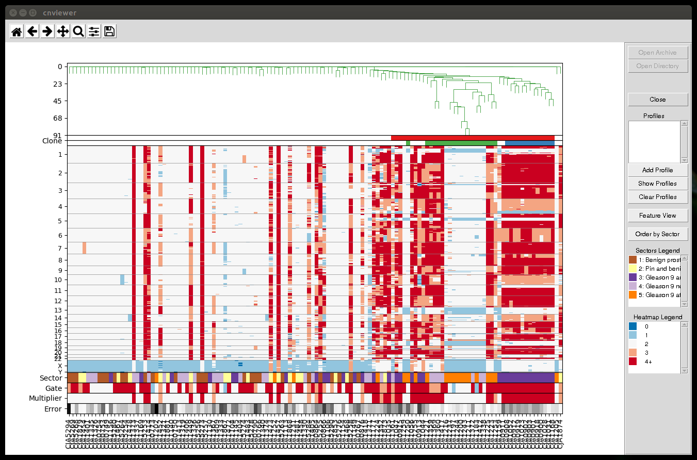
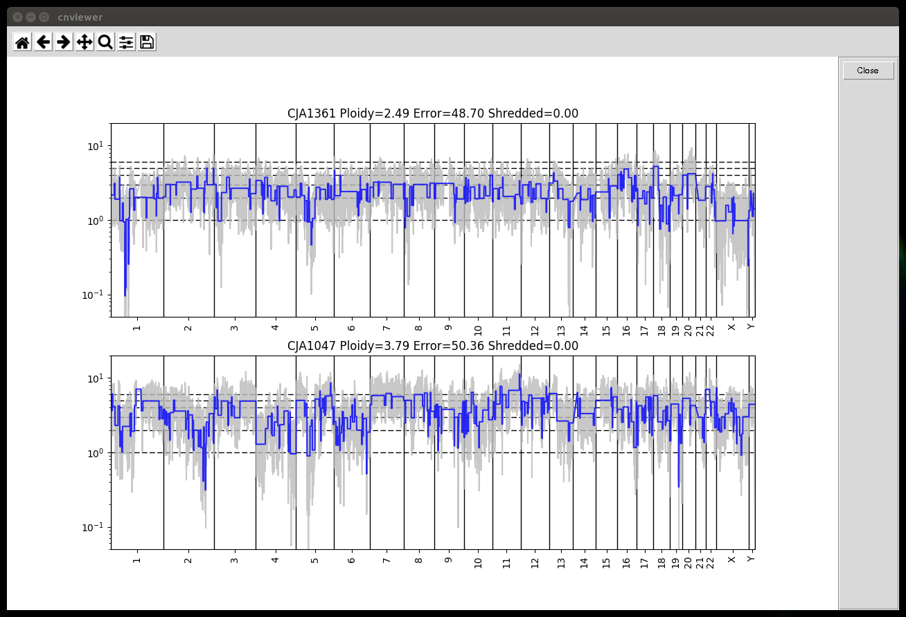
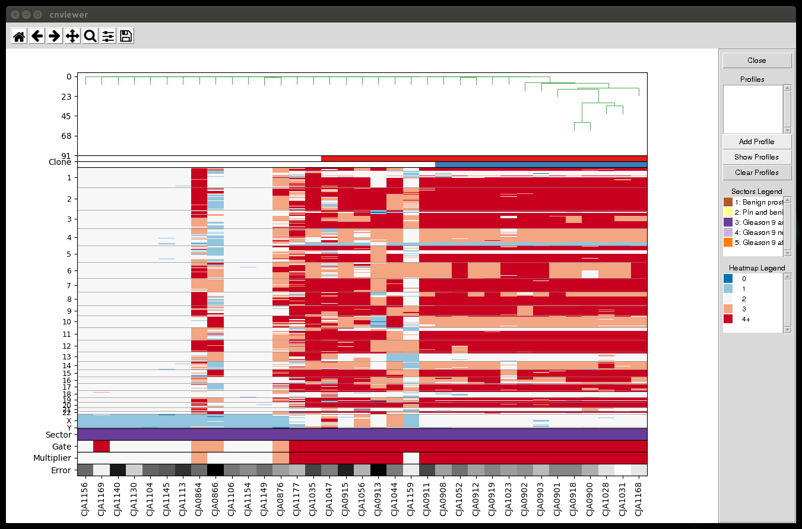

# Interactive single-cell viewer (ISCV) 

ICSV is an interacive graphical tool for single-cell genomics data, with 
emphasis on single-cell genomics of cancer. It facilitates examination, jointly
or individually, of DNA copy number profiles of cells harvested from 
multiple anatomic locations (sectors). In the opening view the copy-number
data matrix, with columns corresponding to cells and rows to genomic locations,
is represented as a heat map with color-encoded integer DNA copy number. If a 
phylogenetic tree is available for the cells comprising the dataset, it can be
be used to order the columns of the data matrix, and clones formed by closely 
related cells may be identified. Alternatively, the columns 
can be ordered by the sector of origin of the cells. Cyto-pathological
information may be displayed in a separate view, including sector-specific
slide images and pathology reports. Genomic sub-regions and
random subsets of cells can be selected and zoomed into. Individual or multiple
copy-number profiles may be plotted as copy number against the genomic 
coordinate, and these plots may again be zoomed into. Chromosomal regions
selected within the profiles may be followed to UCSC genome browser to
examine the genomic context.

## Anaconda Environment Setup

### Install Anaconda 
* Go to anaconda web site 
[https://www.continuum.io/downloads](https://www.continuum.io/downloads)
and download the latest anaconda installer for your operating system. Both 
*Python 2.7* and *Python 3.6* are supported so you can choose your preferred Python
version. 

* Install anaconda into suitable place on your local machine following
instructions from 
[https://docs.continuum.io/anaconda/install](https://docs.continuum.io/anaconda/install)

### Create cnviewer anaconda environment from scratch

* After installing Anaconda you need to create an environment to use with the viewer:

    ```
    conda create -n aviewer
    source activate aviewer
    conda install numpy scipy matplotlib pillow pandas
    ```

### Activate the viewer environment

* If you have existing Anaconda environmen before using it you need to activate it.
To activate the anaconda environment `cnviewer` you need to use the appropriate 
[Anaconda instructions](http://conda.pydata.org/docs/using/envs.html#change-environments-activate-deactivate). 
For `Linux` and `OS X` you should
use:

    ```bash
    source activate aviewer
    ```
On `Windows` you need to use:

    ```bash
    activate aviewer
    ```
* Full instructions on how to use and manage Anaconda environments can be found
here: [http://conda.pydata.org/docs/using/envs.html](http://conda.pydata.org/docs/using/envs.html)

## Dataset Directory Structure

* Files in the dataset should conform to the following naming convention. Each filename
should end with two dot separated words. The last word is the usual file extension
and second to last is the file type. For example:

    ```
    example.featuremat.txt
    ```
is a `txt` file, that contains `featuremat` used by the viewer. Check the example dataset.

* Example dataset directory is located in subdirectory 
`exampledata/example.directory` of the project main directory. The content of the
example dataset directory is as follows:
    ```
    .
    ├── example.cells.csv
    ├── example.clone.txt
    ├── example.genome.txt
    ├── example.guide.txt
    ├── example.featuremat.txt
    ├── example.features.txt
    ├── example.ratio.txt
    ├── example.seg.txt
    ├── example.tree.txt
    └── pathology
        ├── 9727420.color.map.060414.png
        ├── Area1.Benign.jpg
        ├── Area1.Benign.txt
        ├── Area2.PIN.with.Benign.jpg
        ├── Area2.PIN.with.Benign.txt
        ├── Area3.GS9.invading.SV.jpg
        ├── Area3.GS9.invading.SV.txt
        ├── Area4.GS9.near.Urethra.jpg
        ├── Area4.GS9.near.Urethra.txt
        ├── Area5.GS9.at.Capsule.jpg
        ├── Area5.GS9.at.Capsule.txt
        └── description.csv
    ```

* Optionally the dataset directory can contain a `pathology` subdirectory that
contains pathology images and notes. This subdirectory should contain a file called
`description.csv` with the following structure:

    ```
    sector,pathology,image,notes
    1,Benign prostatic tissue,Area1.Benign.jpg,Area1.Benign.txt
    2,Pin and benign prostate,Area2.PIN.with.Benign.jpg,Area2.PIN.with.Benign.txt
    3,Gleason 9 and invading seminal vesicle,Area3.GS9.invading.SV.jpg,Area3.GS9.invading.SV.txt
    4,Gleason 9 near urethra,Area4.GS9.near.Urethra.jpg,Area4.GS9.near.Urethra.txt
    5,Gleason 9 at capsule,Area5.GS9.at.Capsule.jpg,Area5.GS9.at.Capsule.txt
    ```
First column in `description.csv` contains the name/id of the sector as in `guide` file, 
the second column is a description of the sector and the last two columns contain
file names of pathology image and notes.

## Dataset Archive Structure
* Viewer supports datasets stored as a `ZIP` archives. Files from the
archive dataset should follow the same naming convention as for dataset directories.

* Example dataset ZIP archive is found in `exampledata/example.archive.zip` 
into project main directory. The structure of the example dataset is as follows:

    ```
    unzip -t example.archive.zip 
    Archive:  example.archive.zip
        testing: pathology/               OK
        testing: pathology/Area5.GS9.at.Capsule.jpg   OK
        testing: pathology/Area4.GS9.near.Urethra.jpg   OK
        testing: pathology/Area3.GS9.invading.SV.jpg   OK
        testing: pathology/Area2.PIN.with.Benign.jpg   OK
        testing: pathology/Area1.Benign.jpg   OK
        testing: pathology/Area5.GS9.at.Capsule.txt   OK
        testing: pathology/Area4.GS9.near.Urethra.txt   OK
        testing: pathology/Area1.Benign.txt   OK
        testing: pathology/description.csv   OK
        testing: pathology/Area2.PIN.with.Benign.txt   OK
        testing: pathology/Area3.GS9.invading.SV.txt   OK
        testing: example.cells.csv        OK
        testing: example.clone.txt        OK
        testing: example.featuremat.txt   OK
        testing: example.features.txt     OK
        testing: example.genome.txt       OK
        testing: example.guide.txt        OK
        testing: example.ratio.txt        OK
        testing: example.seg.txt          OK
        testing: example.tree.txt         OK
    No errors detected in compressed data of example.archive.zip.    ```
    

## Start the Viewer
* Before starting the viewer you need to activate viewer's Anaconda environment
    ```
    source activate aviewer
    ```

* To start the viewer from project main directory enter into `cnviewer` 
subdirectory and start `tkmain.py`

    ```bash
    cd cnviewer
    python tkmain.py
    ```

## Select Dataset

* Use `Open Archive` and `Open Directory` buttons to open a data set 
for visualization

* `Open Directory` button allows you to select a directory where a dataset is located.
One directory may contain only one dataset.

* `Open Archive` button allow you to select dataset stored as a `ZIP` archive.

## Viewer Main Window

* After dataset is loaded it will displayed into the main window.


* From profiles instruments you can select individual cells to display their CN profile
into single profile viewer.

* Buttons 'Feature View' and 'Reorder by Sector' will display different views of the whole
dataset

* From 'Sectors Legend' you can visualize single sector view and pathology view for
any given sector.

## Copy-number Profile Tools

* If you right click on a single cell it will be added to list of profiles to visualize
from 'Show Profiles' button.

* Profiles could be added to this list using 'Add Profiles' dialog window that is shown
by clicking on 'Add profile' button.

* To show the selected profiles you need to click on 'Show Profiles' button. Selected 
profiles will be visualized into sample viewer:


## Sectors Legend

* Double click on a given sector row will launch single sector viewer


* Right click on a given sector row will display pathology image and notes for
the selected sector


